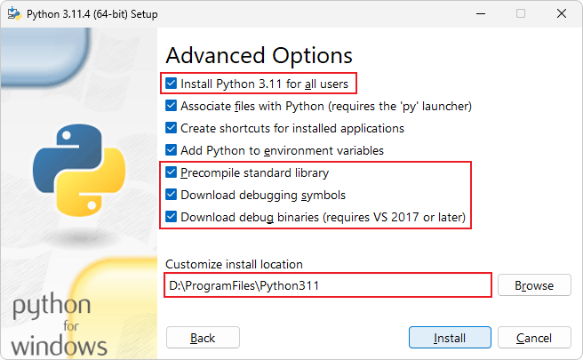
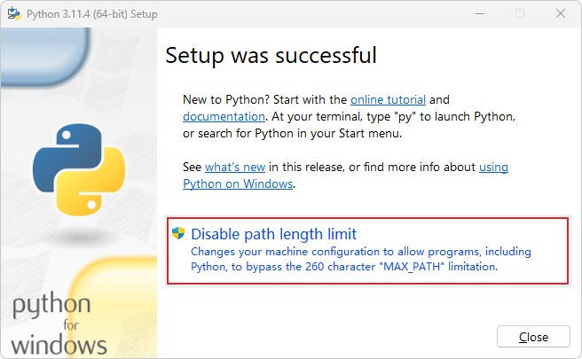
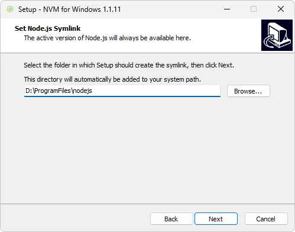
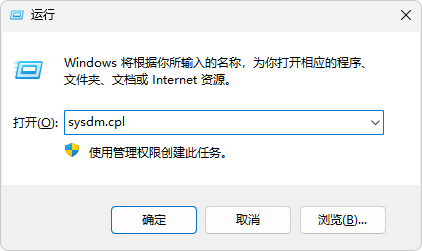
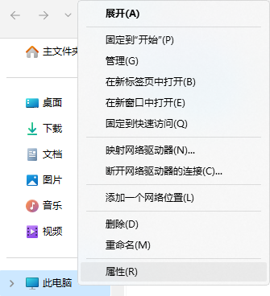
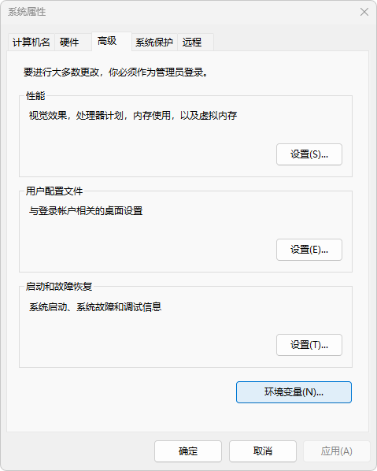
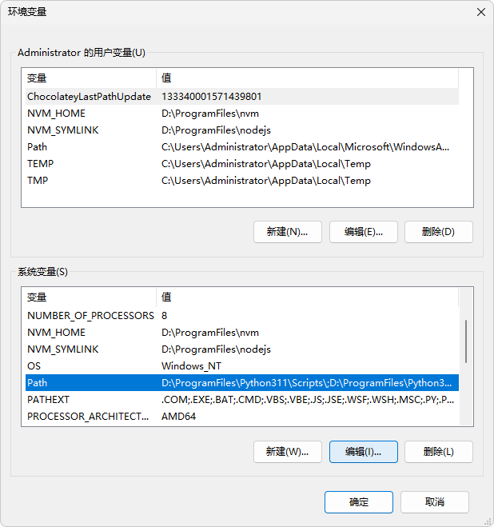
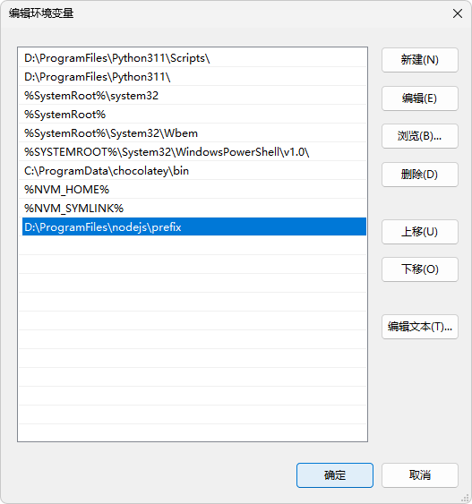

# 环境准备

[Node.js](https://nodejs.org/) 是前端必备，[nrm](https://github.com/Pana/nrm) 是切换 npm 源的，[nvm](https://github.com/nvm-sh/nvm) 是切换 Node 版本的。

## 安装 Python

在安装 Node.js 过程中，勾选`Automatically install the necessary tools……`后会自动安装 Python 到 C 盘，所以先自行安装 Python，后续 Node.js 安装时通过环境变量检测到 Python 就不会再安装。

下载地址：[Download Python | Python.org](https://www.python.org/downloads/)

一定要勾选`Add python.exe to PATH`，将 Python 安装目录添加到 Path 环境变量中。


安装时推荐将所有选项都勾上，以后有 Python 包用到了不用再安装。





## nvm 安装使用

nvm 项目主页：[nvm-sh/nvm: Node Version Manager - POSIX-compliant bash script to manage multiple active node.js versions](https://github.com/nvm-sh/nvm)

在 [Releases · coreybutler/nvm-windows](https://github.com/coreybutler/nvm-windows/releases) 下载并打开`nvm-setup.exe`，选择 nvm 的安装目录和 Node.js 的符号链接。




安装后用户和系统环境变量中会新增`NVM_HOME`、`NVM_SYMLINK`，变量`Path`中会追加`%NVM_HOME%;NVM_SYMLINK;`。

```shell
# 列出 Node.js 版本
$ nvm list available

|   CURRENT    |     LTS      |  OLD STABLE  | OLD UNSTABLE |
|--------------|--------------|--------------|--------------|
|    20.5.0    |   18.17.0    |   0.12.18    |   0.11.16    |
…………

# 安装最新的长期维护版
$ nvm install 18.17.0

# 使用安装的版本
$ nvm use 18.17.0
```

## 修改 npm 配置

修改 npm 全局安装包目录和缓存目录，避免存储到 C 盘。

```shell
# 查看 npm 配置
$ npm config ls

# 修改全局安装包目录
$ npm config set prefix "D:\ProgramFiles\nodejs\prefix"

# 修改缓存目录
$ npm config set cache "D:\Cache\npm\cache"
```

修改完之后，还要将全局安装包目录配置到系统环境变量 PATH 中。

::: info
此处会教一遍如何设置环境变量，后续不再展开。
:::

`Win（Windows 徽标键，一般在 Ctrl 和 Alt 的中间）+ R`输入`sysdm.cpl`。



或者`此电脑`图标右键`属性` - `高级系统设置`，打开系统属性窗口。





或者开始菜单搜索`系统环境……`并打开。


在系统属性窗口，`高级`选项卡中，点击`环境变量`按钮。



在环境变量窗口，系统变量中找到`Path`，点击编辑按钮。



在编辑环境变量窗口，点击新建按钮，编辑为 npm 全局安装包目录`D:\ProgramFiles\nodejs\prefix`，点击确定，环境变量窗口也要确定。



## 安装配置 pnpm

```shell
# 安装 pnpm
$ npm install -g pnpm --registry=https://registry.npmmirror.com

# 创建环境变量，然后新开一个命令行窗口
$ pnpm setup

# 配置 pnpm 各项目录
$ pnpm config set global-dir "D:\ProgramFiles\nodejs\pnpm-global" & pnpm config set global-bin-dir "D:\ProgramFiles\nodejs\prefix" & pnpm config set store-dir "D:\ProgramFiles\nodejs\pnpm-store" & pnpm config set state-dir "D:\Cache\pnpm\state" & pnpm config set cache-dir "D:\Cache\pnpm\cache"
```

## nrm 安装使用

```shell
# 使用淘宝镜像安装 nrm
$ pnpm add -g nrm --registry=https://registry.npmmirror.com

# 查看所有镜像源
$ nrm ls
  npm ---------- https://registry.npmjs.org/
  yarn --------- https://registry.yarnpkg.com/
  tencent ------ https://mirrors.cloud.tencent.com/npm/
  cnpm --------- https://r.cnpmjs.org/
  taobao ------- https://registry.npmmirror.com/
  npmMirror ---- https://skimdb.npmjs.com/registry/

# 使用镜像源
$ nrm use taobao
 SUCCESS  The registry has been changed to 'taobao'.
```

## 安装微信开发者工具

下载地址：[微信开发者工具下载地址与更新日志 | 微信开放文档](https://developers.weixin.qq.com/miniprogram/dev/devtools/download.html)

下载系统对应的稳定版并打开安装。


申请小程序测试号：[申请测试号 | 微信开放文档](https://developers.weixin.qq.com/miniprogram/dev/devtools/sandbox.html)

## 安装 JSON Server

项目主页：[typicode/json-server: Get a full fake REST API with zero coding in less than 30 seconds (seriously)](https://github.com/typicode/json-server)

```shell
# 全局安装 JSON Server
$ pnpm install -g json-server 
```
