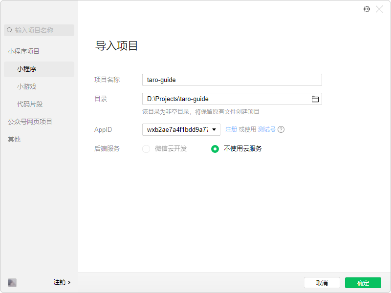
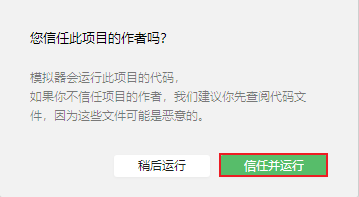
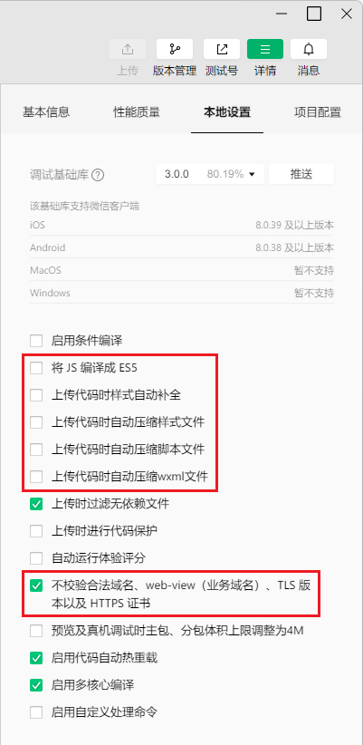
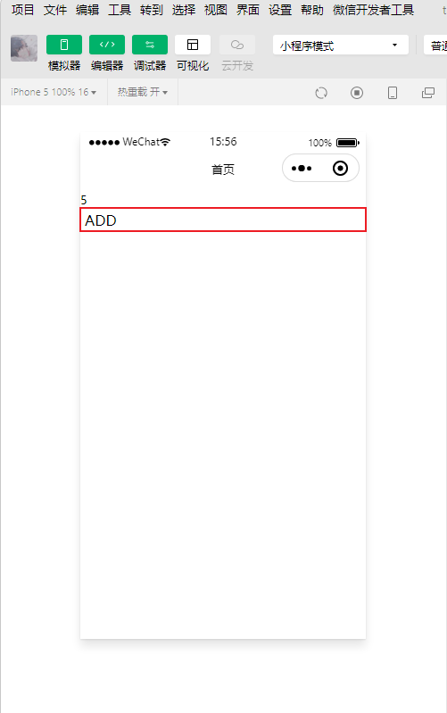

# 初始化项目

Taro 项目使用 Taro 命令行工具（[Taro CLI](https://www.npmjs.com/package/@tarojs/cli)）进行开发。

初始化后的[项目目录结构](https://taro-docs.jd.com/docs/folder#%E9%A1%B9%E7%9B%AE%E7%9B%AE%E5%BD%95%E7%BB%93%E6%9E%84)如下：

```
├── dist                        编译结果目录
|
├── config                      项目编译配置目录
|   ├── index.js                默认配置
|   ├── dev.js                  开发环境配置
|   └── prod.js                 生产环境配置
|
├── src                         源码目录
|   ├── pages                   页面文件目录
|   |   └── index               index 页面目录
|   |       ├── index.js        index 页面逻辑
|   |       ├── index.css       index 页面样式
|   |       └── index.config.js index 页面配置
|   |
|   ├── app.js                  项目入口文件
|   ├── app.css                 项目总通用样式
|   └── app.config.js           项目入口配置
|
├── project.config.json         微信小程序项目配置 project.config.json
├── project.tt.json             抖音小程序项目配置 project.tt.json
├── project.swan.json           百度小程序项目配置 project.swan.json
├── project.qq.json             QQ 小程序项目配置 project.qq.json
|
├── babel.config.js             Babel 配置
├── tsconfig.json               TypeScript 配置
├── .eslintrc                   ESLint 配置
|
└── package.json
```


## 安装 

```shell
# 全局安装 Taro CLI
$ pnpm add -g @tarojs/cli

# 创建项目目录
$ mkdir -p D:\Projects
# 移动到项目目录
$ cd D:\Projects
$ D:

# 初始化项目
$ taro init taro-guide
Taro 即将创建一个新项目!
Need help? Go and open issue: https://tls.jd.com/taro-issue-helper

? 请输入项目介绍 

? 请选择框架
  React
  PReact
  Vue
> Vue3

? 是否需要使用 TypeScript ？ (Y/n)
? 请选择 CSS 预处理器（Sass/Less/Stylus）
> Sass
  Less
  Stylus
  无
  
? 请选择编译工具
> Webpack5
  Webpack4
  
? 请选择包管理工具
  yarn
> pnpm
  npm
  cnpm
  
? 请选择模板源 (Use arrow keys)
> Gitee（最快）
  Github（最新）
  CLI 内置默认模板
  自定义
  社区优质模板源

? 请选择模板
  默认模板
  h5-youshu
  pwa
  taro-hooks@canary（使用 taro-hooks canary 版本的模板）
  vue3-NutUI4（使用 NutUI4.0 的模板）
> vue3-pinia（Vue3 + Pinia 模板（https://pinia.esm.dev/））
  wxplugin
```

## 预览

```shell
# 进入项目目录
$ cd taro-guide

# 安装依赖
$ pnpm install

# 编译运行
$ pnpm run dev:weapp
```

打开微信开发者工具，小程序导入，选择**项目根目录**。





按照[“安装及使用”](https://taro-docs.jd.com/docs/GETTING-STARTED#%E5%B0%8F%E7%A8%8B%E5%BA%8F%E5%BC%80%E5%8F%91%E8%80%85%E5%B7%A5%E5%85%B7)在微信开发者工具的**详情 - 本地设置**中取消勾选这些项。

另外还要取消勾选**不校验合法域名、web-view（业务域名）、TLS 版本以及 HTTPS 证书**，因为需要请求 JSON Server 的 localhost 本地地址获取数据，否则会报错“不在以下 request 合法域名列表中”。



在**模拟器**中点击“ADD”按钮，可以看到按钮上的数字在增加。


