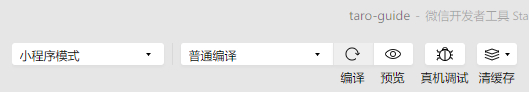
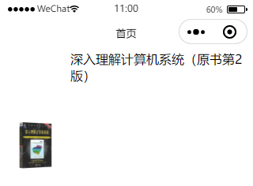
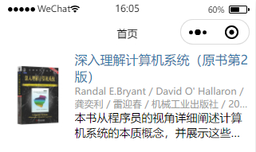

# 基础教程

先看`src`源码目录。

## 全局配置

`app.config.ts`文件用来对小程序进行全局配置，配置项遵循**微信小程序规范**，并且对所有平台进行统一。

更多：[全局配置 | Taro 文档](https://taro-docs.jd.com/docs/app-config)

`src/app.config.ts`：
```ts
export default {
  // 指定小程序由哪些页面组成：https://taro-docs.jd.com/docs/app-config#pages
  pages: [
    'pages/index/index'
  ],
  // 设置小程序的状态栏、导航条、标题、窗口背景色
  window: {
    // 下拉 loading 的样式，仅支持 dark / light
    backgroundTextStyle: 'light',
    // 导航栏背景颜色
    navigationBarBackgroundColor: '#fff',
    // 导航栏标题文字内容
    navigationBarTitleText: 'WeChat',
    // 导航栏标题颜色
    navigationBarTextStyle: 'black'
  }
}
```

## 入口组件

每一个 Taro 应用都需要一个入口组件（Vue 组件）用来注册应用。

在入口组件中我们可以设置全局状态或访问小程序入口实例的生命周期。

更多：[入口组件 | Taro 文档](https://taro-docs.jd.com/docs/vue-entry)

`src/app.ts`：
```ts
import { createApp } from 'vue'
import { createPinia } from 'pinia'

import './app.scss'

const App = createApp({
  onShow(options) {
  },
  // 入口组件不需要实现 render 方法，即使实现了也会被 taro 所覆盖
})
// 在 Vue 应用中安装 Pinia
App.use(createPinia())
// 导出 Vue 应用实例
export default App
```

## 页面组件和页面配置

每一个 Taro 应用都至少包括一个页面组件，页面组件可以通过 Taro 路由进行跳转，也可以访问小程序页面的生命周期。

页面默认放在`src/pages`目录下，页面需要在全局配置的`pages`中配置。

更多：[页面组件 | Taro 文档](https://taro-docs.jd.com/docs/vue-page)

**src/pages/index/index.vue**：
```vue
<template>
  <!-- 根视图 -->
  <view class="index">
    <!-- Counter 组件 -->
    <Counter/>
  </view>
</template>

<script>
// 引入样式文件
import './index.scss'
// 引入 Counter 组件
import Counter from '../../components/Counter.vue'

export default {
  // 组件名称
  name: 'Index',
  // 注册组件
  components: {
    Counter
  }
}
</script>
```

每个页面组件都会有页面组件配置，用于对页面进行单独配置。

更多：[页面配置 | Taro 文档](https://taro-docs.jd.com/docs/page-config)

**src/pages/index/index.config.ts**：

```ts
export default {
  // 导航栏标题文字内容
  navigationBarTitleText: '首页'
}
```

## JSON Server 和自定义组件

### 运行 JSON Server

在项目根目录下新增 **db.json**：
```json
{
  "dicts": [
    {
      "id": 1,
      "type": "author",
      "name": "作者",
      "value": 1
    },
    {
      "id": 2,
      "type": "author",
      "name": "译者",
      "value": 2
    },
    {
      "id": 3,
      "type": "press",
      "name": "机械工业出版社",
      "value": 1
    }
  ],
  "authors": [
    {
      "id": 1,
      "name": "Randal E.Bryant",
      "type": 1,
      "desc": "1973年于密歇根大学（University of Michigan）获得学士学位，随即就读于麻省理工学院的研究生院，并在1981年获计算机博士学位。他在加州理工学院（California Institute of Technology）做了三年助教，从1984年至今一直是卡内基-梅隆大学的教师。他现在是计算机科学的大学教授和计算机科学学院的院长。他同时还受邀于电子和计算机工程系。\n他从事本科生和研究生计算机系统方面课程的教学超过30年。在讲授计算机体系结构课程多年后，他开始把关注点从如何设计计算机转移到程序员如何在更好的了解系统的情况下编写出更有效和更可靠的程序。他和O’Hallaron教授一起在卡内基梅隆大学开设了15-213“计算机系统导论”课程，那便是此书的基础。他还教授一些有关算法、编程、计算机网络和VLSI（超大规模集成电路）设计方面的课程。\nBryant教授的主要研究内容是设计软件工具来帮助软件和硬件设计者验证其系统正确性。其中，包括几种类型的模拟器，以及用数学方法来证明设计正确性的形式化验证工具。他发表了150多篇技术论文。包括Intel、FreeScale、IBM和Fujitsu在内的主要计算机制造商都使用着他的研究成果。他还因他的研究获得过数项大奖。其中包括Semiconductor Research Corporation颁发的两个发明荣誉奖和一个技术成就奖，ACM颁发的Kanellakis理论与实践奖，还有IEEE授予的W.R.G.Baker奖、Emmanuel Piore奖和Phil Kaufman奖。他还是ACM院士、IEEE院士和美国国家工程院院士。"
    },
    {
      "id": 2,
      "name": "David O' Hallaron",
      "type": 1,
      "desc": "现为Intel匹兹堡实验室主任，卡内基-梅隆大学电子和计算机工程系副教授。在弗吉尼亚大学获得计算机科学的博士学位。\n他教授本科生和研究生的计算机系统方面的课程，例如计算机体系结构、计算机系统导论、并行处理器设计和Internet服务。他和Bryant教授一起开设了“计算机系统导论”课程，那便是此书的基础。2004年他获得了CMU计算机学院颁发的Herbert Simon杰出教学奖，这个奖项的获得者是基于学生的投票产生的。\nO’Hallaron教授从事计算机系统领域的研究，主要兴趣在于科学计算、数据密集型计算和虚拟化方面的软件系统。其中最著名的是Quake项目，一群计算机科学家、土木工程师和地震学家致力于提高对强烈地震中大地运动的预测能力。2003年，他同Quake项目中其他成员一起获得了高性能计算领域中的最高国际奖项—Gordon Bell奖。"
    },
    {
      "id": 3,
      "name": "龚奕利",
      "type": 2,
      "desc": ""
    },
    {
      "id": 4,
      "name": "雷迎春",
      "type": 2,
      "desc": ""
    }
  ],
  "books": [
    {
      "id": 1,
      "name": "深入理解计算机系统（原书第2版）",
      "authors": [
        1,
        2,
        3,
        4
      ],
      "coverUrl": "http://img3m2.ddimg.cn/74/17/20968472-1_u_8.jpg",
      "isbn": "9787111321330",
      "publicationTime": "2011-01",
      "presses": [
        1
      ],
      "desc": "本书从程序员的视角详细阐述计算机系统的本质概念，并展示这些概念如何实实在在地影响应用程序的正确性、性能和实用性。全书共12章，主要内容包括信息的表示和处理、程序的机器级表示、处理器体系结构、优化程序性能、存储器层次结构、链接、异常控制流、虚拟存储器、系统级I/O、网络编程、并发编程等。书中提供大量的例子和练习，并给出部分答案，有助于读者加深对正文所述概念和知识的理解。\n本书的最大优点是为程序员描述计算机系统的实现细节，帮助其在大脑中构造一个层次型的计算机系统，从最底层的数据在内存中的表示到流水线指令的构成，到虚拟存储器，到编译系统，到动态加载库，到最后的用户态应用。通过掌握程序是如何映射到系统上，以及程序是如何执行的，读者能够更好地理解程序的行为为什么是这样的，以及效率低下是如何造成的。\n本书适合那些想要写出更快、更可靠程序的程序员阅读，也适合作为高等院校计算机及相关专业本科生、研究生的教材。"
    }
  ]
}
```
启动 JSON Server：
```shell
$ json-server db.json
```

### 自定义组件查询图书封面和名称

先定义类型，后面需要使用。

**types/book.d.ts**：

```ts
interface Book {
  id: number;
  name: string;
  authors: number[];
  coverUrl: string;
  isbn: string;
  publicationTime: string;
  presses: number[];
  desc: string;
}

```

图书组件 **src/components/BookList/index.vue**：
```vue
<template>
  <view>
    <view v-for="book in books" :key="book.id" :class="styles.bookItem">
      <view :class="styles.bookCover">
        <image :src="book.coverUrl" alt="封面" mode="aspectFit"/>
      </view>
      <view>
        <view>
          <text>{{ book.name }}</text>
        </view>
      </view>
    </view>
  </view>
</template>

<!-- 单文件组件 - <script setup>：https://cn.vuejs.org/api/sfc-script-setup.html#script-setup -->
<script setup lang="ts">
import {onMounted, ref} from 'vue';
import Taro from '@tarojs/taro';
// 小程序中不支持 <style scoped>，使用 cssModules 代替：https://github.com/NervJS/taro/issues/6662
import styles from './index.module.scss';

// 响应式对象，存储图书列表。组合式 API - 响应式：核心 - ref()：https://cn.vuejs.org/api/reactivity-core.html#ref
const books = ref([] as Book[]);

// 组件挂载完成后执行。组合式 API：生命周期钩子 - onMounted()：https://cn.vuejs.org/api/composition-api-lifecycle.html#onmounted
onMounted(() => {
  // 网络 - 发起请求 - request：https://taro-docs.jd.com/docs/apis/network/request/
  Taro.request({
    url: 'http://localhost:3000/books',
    success: (res) => {
      books.value = res.data;
    }
  })
});

</script>
```

`config/index.js`开启 cssModules：**config.mini.postcss.cssModules.enable** 和 **config.h5.postcss.cssModules.enable** 改为 true。

图书组件样式（cssModules） **src/components/BookList/index.module.scss**：
```scss
.bookItem {
  display: flex;
  flex-direction: row;

  .bookCover {
    width: 30%;

    image {
      width: 100%;
    }
  }
}
```

再将图书组件放到首页。

**src/pages/index/index.vue**：

```vue {6-7,16,24}
<template>
  <!-- 根视图 -->
  <view class="index">
    <!--&lt;!&ndash; Counter 组件 &ndash;&gt;-->
    <!--<Counter/>-->
    <!-- 图书列表组件 -->
    <BookList />
  </view>
</template>

<script>
// 引入样式文件
import './index.scss'
// // 引入 Counter 组件
// import Counter from '../../components/Counter.vue'
import BookList from "../../components/BookList";

export default {
  // 组件名称
  name: 'Index',
  // 注册组件
  components: {
    // Counter,
    BookList
  }
}
</script>
```

在微信开发者工具的工具栏中点击**编译**，模拟器中会显示封面和图片。





## 查询图书其他信息

通过观察`db.json`结构可以发现，图书的`authors`属性为数组，存储作者、译者、主编等的 ID，`presses`属性也是数组，存储多个出版社 ID。

::: info
作者、译者、主编等图书制作人员，都算是图书的“作者”，后续不再赘述，只称为作者。
:::

新增定义类型：

**types/author.d.ts**：
```ts
interface Author {
  id: number;
  name: string;
  type: number;
  desc: string;
}
```

**types/dict.d.ts**：
```ts
interface Dict {
  id: number;
  type: string;
  name: string;
  value: number;
}
```

`Book`类型新增自定义字段，用于展示数据。

**types/book.d.ts**：
```ts {10-13}
interface Book {
  id: number;
  name: string;
  authors: number[];
  coverUrl: string;
  isbn: string;
  publicationTime: string;
  presses: number[];
  desc: string;

  // 自定义字段
  authorList?: Author[];
  pressNames?: string[];
}
```

图书列表组件中，在获取图书数据后，获取作者和出版社数据。

**src/components/BookList/index.vue**：
```vue {7-18,41-65}
<template>
  <view>
    <view v-for="book in books" :key="book.id" :class="styles.bookItem">
      <view :class="styles.bookCover">
        <image :src="book.coverUrl" alt="封面" mode="aspectFill"/>
      </view>
      <view :class="styles.bookAttrs">
        <view :class="styles.bookTitle">
          <text>{{ book.name }}</text>
        </view>
        <view :class="styles.bookAuthorsAndPress">
          <text v-for="author in book.authorList">{{ author.name }} /</text>
          <text v-for="pressName in book.pressNames">{{ pressName }} /</text>
          <text>{{ book.publicationTime }}</text>
        </view>
        <view :class="styles.bookDesc">
          <text>{{ book.desc }}</text>
        </view>
      </view>
    </view>
  </view>
</template>

<!-- 单文件组件 - <script setup>：https://cn.vuejs.org/api/sfc-script-setup.html#script-setup -->
<script setup lang="ts">
import {onMounted, ref} from 'vue';
import Taro from '@tarojs/taro';
// 小程序中不支持 <style scoped>，使用 cssModules 代替：https://github.com/NervJS/taro/issues/6662
import styles from './index.module.scss';

// 响应式对象，存储图书列表。组合式 API - 响应式：核心 - ref()：https://cn.vuejs.org/api/reactivity-core.html#ref
const books = ref([] as Book[])

// 组件挂载完成后执行。组合式 API：生命周期钩子 - onMounted()：https://cn.vuejs.org/api/composition-api-lifecycle.html#onmounted
onMounted(() => {
  // 网络 - 发起请求 - request：https://taro-docs.jd.com/docs/apis/network/request/
  Taro.request({
    url: 'http://localhost:3000/books',
    success: (res) => {
      books.value = res.data;

      books.value.forEach((book: Book) => {
        // 获取图书相关人员
        Taro.request({
          url: `http://localhost:3000/authors?${book.authors.map(authorId => `id=${authorId}`).join('&')}`,
          success: (res) => {
            book.authorList = [];
            for (const author of res.data) {
              if (author.type === 1 || author.type === 2) {
                book.authorList.push(author);
              }
            }
          }
        });

        // 获取图书出版社
        Taro.request({
          url: `http://localhost:3000/dicts?type=press&${book.presses.map(pressId => `value=${pressId}`).join('&')}`,
          success: (res) => {
            book.pressNames = [];
            for (const press of res.data) {
              book.pressNames.push(press.name);
            }
          }
        });
      })
    }
  })
});

</script>
```

**src/components/BookList/index.module.scss**：
```scss {1-10,20,23-42}
@mixin omitGt2Lines {
  // 允许单词内换行，避免 Text 组件不换行
  word-break: break-all;
  // 超过 2 行用省略号显示
  display: -webkit-box;
  overflow: hidden;
  -webkit-line-clamp: 2;
  -webkit-box-orient: vertical;
}

.bookItem {
  display: flex;
  flex-direction: row;

  .bookCover {
    width: 30%;

    image {
      width: 100%;
      height: 100%;
    }
  }

  .bookAttrs {
    width: 70%;
    margin-right: 20px;

    .bookTitle {
      color: #37a;
    }

    .bookAuthorsAndPress {
      @include omitGt2Lines;
      color: #999;
      font-size: 30px;
    }

    .bookDesc {
      @include omitGt2Lines;
      font-size: 35px;
    }
  }
}
```

编译后再看效果：


